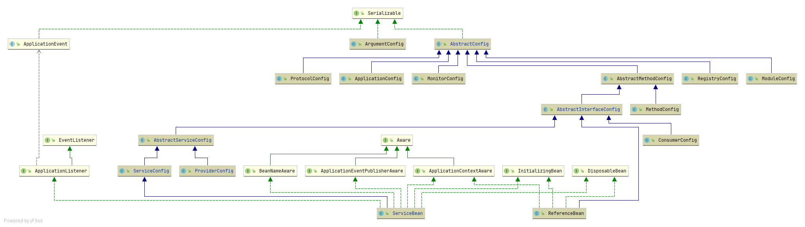
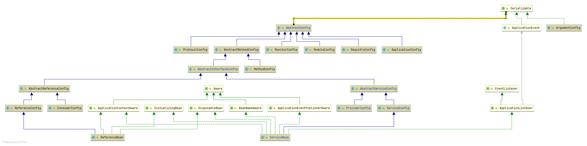

**服务消费者配置**

1. 抽象引用配置类AbstractReferenceConfig
2. 服务消费者默认配置ConsumerConfig
3. 服务消费者引用配置类ReferenceConfig(这里有一个点, 看到没有这个类, 它与spring是无关的, 也就是没有spring,也是可以使用的)

   1. 进一步初始化 ReferenceConfig 对象
   2. 校验 ReferenceConfig 对象的配置项
   3. 使用 ReferenceConfig 对象，生成 Dubbo URL 对象数组
   4. 使用 Dubbo URL 对象，应用服务
   5. 主要是ReferenceConfig.get()方法

**属性配置**

1. 将自动加载 classpath 根目录下的 dubbo.properties ，可以通过JVM启动参数 -Ddubbo.properties.file=xxx.properties 改变缺省配置位置
2. AbstractConfig读取启动参数变量和 properties 配置到配置对象
