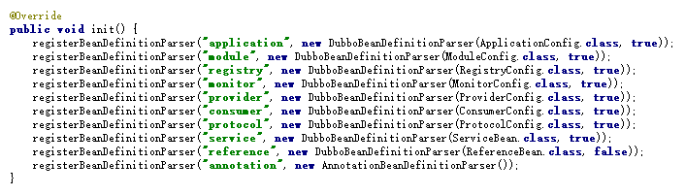
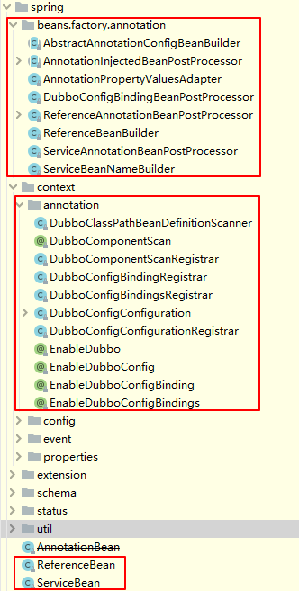
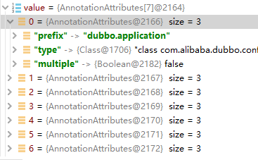

**服务消费者配置**

1. 抽象引用配置类AbstractReferenceConfig
2. 服务消费者默认配置ConsumerConfig
3. 服务消费者引用配置类ReferenceConfig(这里有一个点, 看到没有这个类, 它与spring是无关的, 也就是没有spring,也是可以使用的)
   1. 进一步初始化 ReferenceConfig 对象
   2. 校验 ReferenceConfig 对象的配置项
   3. 使用 ReferenceConfig 对象，生成 Dubbo URL 对象数组
   4. 使用 Dubbo URL 对象，应用服务
   5. 主要是ReferenceConfig.get()方法

**属性配置**

1. 将自动加载 classpath 根目录下的 dubbo.properties ，可以通过JVM启动参数 -Ddubbo.properties.file=xxx.properties 改变缺省配置位置
2. AbstractConfig读取启动参数变量和 properties 配置到配置对象

**XML配置**

1. 定义:
   1. dubbo.xsd
      1. <xsd:element name="" />, 定义了元素的名称, 例如, <xsd:element name="application" />对应<dubbo:application />
      2. <xsd:element type="" />, 定义了内建数据类型的名称, 例如, <xsd:element type="applicationType" />对应<xsd:complexType name="applicationType" />
      3. <xsd:complexType name="" />, 定义了复杂类型, 例如<xsd:complexType name="applicationType" />
   2. spring.handlers -> DubboNamespaceHandler, 定义了Dubbo的XML Namespace的处理器DubboNamespaceHandler

**注解配置**

1. EnableDubbo
   1. @EnableDubboConfig

      > 1. DubboConfigConfigurationRegistrar, 实现ImportBeanDefinitionRegistrar接口， 处理@EnableDubboConfig注解，注册相应的DubboConfigConfiguration到Spring容器中。
      > 2. DubboConfigConfiguration
      >    `就是一个Single和Multiple内部类， 其上都有@EnableDubboConfigBindings和@EnableDubboConfig注解`
      >    `前者Single， 其上的注解， prefix都是单数`
      >    `后者Multiple, 其上的注解, prefix都是复数, 且有multiple=true`
      > 3. @EnableDubboConfigBindings
      >    `DubboConfigBindingsRegistrar:表明使用DubboConfigBindingsRegistrar类进行导入`
      >    3.1. `DubboConfigBindingsRegistrar实现ImportBeanDefinitionRegistrar, EnvironmentAware接口, 处理@EnableDuboConfigBindings注解, 注册相应的Dubbo AbstractConfig到Spring容器中`
      >    
      > 4. @EnableDubboConfigBinding
      >    4.1. DubboConfigBindingRegistrar注册相应的AbstractConfig到容器中
      >    4.1.1. registerBeanDefinitions
      >    4.1.1.1. resolveMultipleBeanNames
      >    4.1.1.2. resolveSingleBeanName
      >    4.1.1.3. registerDubboConfigBean
      >    4.1.1.4. registerDubboConfigBindingBeanPostProcessor
      > 5. DubboConfigBindingBeanPostProcessor
      >    5.1. DubboConfigBinder数据绑定
      >    5.2. DefaultDubboConfigBinder将配置属性设置到Dubbo config对象中
      >
   2. @DubboComponentScan`配置要扫描@Service和@Reference注解的包或者类们, 从而创建对应的bean对象

      > 1. DubboComponentScanRegistrar, Buddo启动类上的一个引用配置的顶级接口， 它会去注册一些后续使用的BeanPostProcess处理器
      >    1.1. getPackagesToScan(importingClassMetadata);// 得到将要扫描的包
      >    1.2. registerServiceAnnotationBeanPostProcessor(packagesToScan, registry);// 注册一个后处理器， 去扫描那些Dubbo Service标注的类
      >    1.3. registerReferenceAnnotationBeanPostProcessor(registry);// 注册一个后处理器， 去扫描那些@Reference标注的类
      > 2. ServiceAnnotationBeanPostProcessor// 扫描被@Service标注的类
      >    2.1. postProcessBeanDefinitionRegistry执行这个后处理器
      >    2.2. resolvePackagesToScan// 解析包路径
      >    2.3. findServiceBeanDefinitionHolders// 得到BeanDefinition持有器
      >    2.4. registerServiceBean// 注册这些；Bean
      >    2.4.1. 创建一个BeanDefinition扫描器*DubboClassPathBeanDefinitionScanner*， 这里也是可以学习的点， 我们也可以这样的
      >    2.4.2. 解析得到一个名称生成器BeanNameGenerator
      >    2.4.3. 给这个扫描器设置它要扫描的注解@Service
      >
      >    *scanner.addIncludeFilter(new AnnotationTypeFilter(Service.class))*
      >    2.4.4. 遍历包数组
      >
      >    2.4.4.1. 这个包扫描器去扫描这个包*scanner.scan(packageToScan);*
      >    2.4.4.2. 找到这个BeanDefinition持有器*findServiceBeanDefinitionHolders*
      >    2.4.4.3. 注册这个Bean到容器中去*registerServiceBean*
      >    2.4.4.3.1. 这里挺有意思的, 可以深究
      >    2.4.4.3.2. buildServiceBeanDefinition(构建这个bean的定义, 里面有许多的自定义配置属性)
      >
      >    3. ReferenceAnnotationBeanPostProcessor
      >       3.1. ReferenceAnnotationBeanPostProcessor
      >       3.1.1. AnnotationInjectedBeanPostProcessor#postProcessPropertyValues从这里开始划算了
      >       3.1.1.1. element#inject(target, beanName, pvs);元素注入
      >       3.1.1.1.1. AnnotatedMethodElement#inject
      >       3.1.1.1.1.1. AnnotationInjectedBeanPostProcessor#getInjectedObject
      >       3.1.1.1.1.1.1. ReferenceAnnotationBeanPostProcessor#doGetInjectedBean
      >       3.1.1.1.1.1.1.1. buildReferenceBeanIfAbsent
      >       3.1.1.1.1.1.1.1.1. buildReferenceBeanIfAbsent#build
      >       3.1.1.1.1.1.1.1.1.1. 检查依赖
      >       3.1.1.1.1.1.1.1.1.2. 生成
      >       3.1.1.1.1.1.1.1.1.3. 配置
      >       3.1.1.1.1.1.1.2. 缓存起来
      >       3.1.1.1.1.1.1.3. buildProxy(referencedBeanName, referenceBean, injectedType);创建代理
      >       3.1.1.1.1.2. 调用属性的set方法, 将这个新建的bean给设置进去
      >       3.2. doGetInjectedBean
      >       3.2.1. 获得注入的bean
      >       3.3. onApplicationEvent
      >       3.3.1. 暴露事件
      >       3.4. ReferenceBeanBuilder
      >
